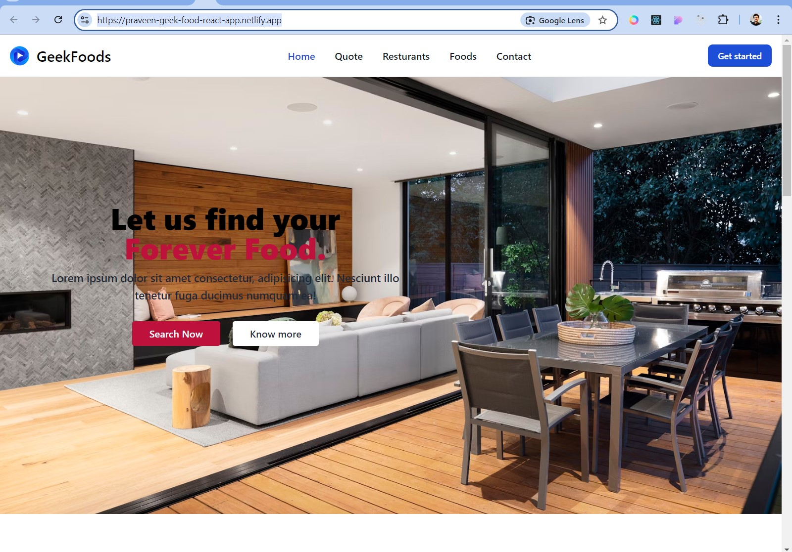
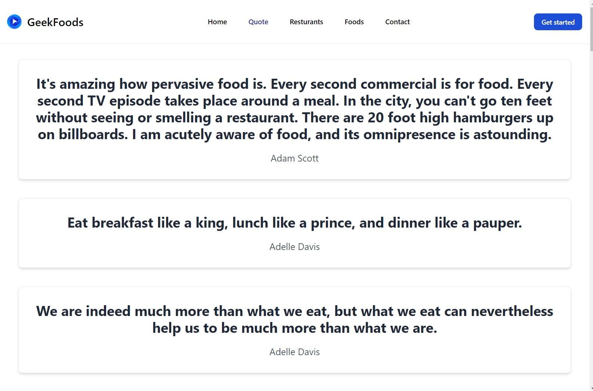

# Geek Food - Home Page & Quote Page

Welcome to the **Geek Food** Home Page & Quote Page project! This project is built using **ReactJS** and serves as the digital front door of the Geek Food brand. It includes a navigation bar, hero section, card section, and footer to create a seamless and visually appealing user experience.

## Project Overview

The goal of this project was to design and develop the main home page for Geek Food, following modern web design principles and using **ReactJS** for building a responsive, dynamic user interface.

### Live Demo

You can view the live demo of the project here:

[Geek Food App](https://praveen-geekfood-app.netlify.app/)

## Features

- **Responsive Navigation Bar**: Includes links to various sections of the website such as Home, About, Menu, and Contact.
- **Hero Section**: A visually appealing banner showcasing the main offerings of Geek Food.
- **Card Section**: Displays various food items or offers, designed as cards for easy user interaction.
- **Footer**: Includes social media links, contact information, and important links.
- **Quote Section**: A section dedicated to showcasing a quote related to food or a relevant message.
- **Smooth Animations**: The project incorporates smooth animations to enhance the user experience.
- **Accessibility**: The project is designed with accessibility in mind, ensuring that all users can navigate and
  interact with the website easily.
- **Code Quality**: The code is well-structured, readable, and follows best practices for maintainability and scalability.

## Technology Stack

- **ReactJS**: A JavaScript library for building user interfaces. React was used for handling the UI, state management, and component structure.
- **Tailwind CSS/Styled Components**: For styling the website, ensuring responsiveness and a modern look.
- **JavaScript (ES6+)**: Used for adding interactivity and handling component logic.
- **Netlify**: Hosting platform for deploying the project.

## ScreenShot

**Home Page** 
**Quote Page** 
